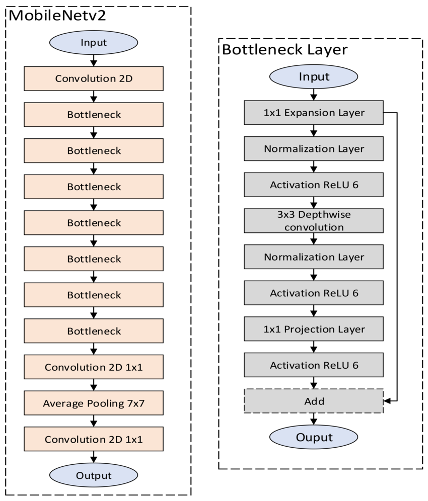
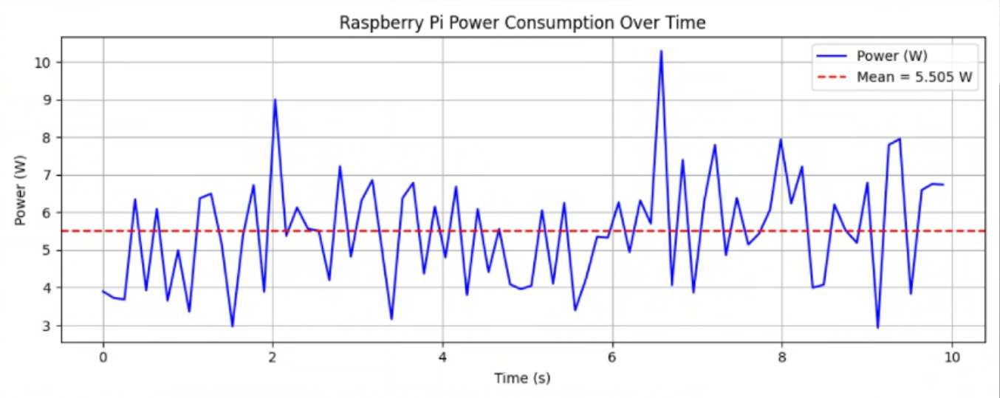
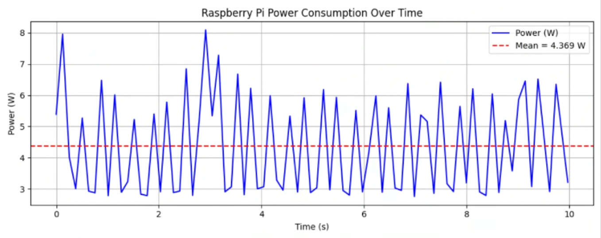

# ECE-556-RaspberryPi-Emotion-Recog
WPI ECE 556 Raspberry Pi Emotion Recognition Deep Learning Project

# How to run code:

Demo example was run on Raspberry Pi 5 with a IMX708 camera module. Cloning the repository with the correct hardware configuration (Camera module in cam1 location) will allow you to run the code. A window will open with the camera feed and model inference overlay, displaying the frame time and model inference time. Demo video can be accessed on youtube with the following link https://youtu.be/TvRDpmDnxk0. The code utilizes a rolling average with the most common predicted label over the previous few inferences to create a smoothed displayed label, this may cause a slightly noticeable delay in the displayed label and emotion demonstrated.

1. Install python requirements (torch, transformers, picamera2, opencv-python)
2. python3 original_example.py (Full Model)
3. python3 quantized_example.py (Quant + Prune Model)
4. python3 power_monitor.py (Calculates SOC Power over 10 second interval)

# Architecture Diagram:

MobileNet V2 Model Architecture
| Layer Type                  | Input Size    | Output Size   | Kernel Size | Stride | Expansion Factor |
|----------------------------|---------------|----------------|-------------|--------|------------------|
| Initial Conv               | 224x224x3     | 112x112x32     | 3x3         | 2      | -                |
| Inverted Residual Block    | 112x112x32    | 112x112x16     | 3x3         | 1      | 1                |
| Inverted Residual Block x2 | 112x112x16    | 56x56x24       | 3x3         | 2      | 6                |
| Inverted Residual Block x3 | 56x56x24      | 28x28x32       | 3x3         | 2      | 6                |
| Inverted Residual Block x4 | 28x28x32      | 14x14x64       | 3x3         | 2      | 6                |
| Inverted Residual Block x3 | 14x14x64      | 14x14x96       | 3x3         | 1      | 6                |
| Inverted Residual Block x3 | 14x14x96      | 7x7x160        | 3x3         | 2      | 6                |
| Inverted Residual Block x1 | 7x7x160       | 7x7x320        | 3x3         | 1      | 6                |
| Final Conv                 | 7x7x320       | 7x7x1280       | 1x1         | 1      | -                |
| Global Avg Pooling         | 7x7x1280      | 1x1x1280       | -           | -      | -                |
| Fully Connected            | 1x1x1280      | 1x1x1000       | -           | -      | -                |

Tragoudaras, Antonios & Stoikos, Pavlos & Fanaras, Konstantinos & Tziouvaras, Athanasios & Floros, George & Dimitriou, Georgios & Kolomvatsos, Kostas & Stamoulis, Georgios. (2022). Design Space Exploration of a Sparse MobileNetV2 Using High-Level Synthesis and Sparse Matrix Techniques on FPGAs. Sensors. 22. 4318. 10.3390/s22124318. 

# Model Performance Analysis

Validation Loss:

Accuracy:

Precision:

Recall:

F1:

# On Device Measurements

File Size Comparison
| Model           | File Size |
|-----------------|-----------|
| Full            | 13.5MB    |
| Quant + Prune   | 8.68MB    |

| Config                         | Memory Usage | CPU Usage | Power Consumption | Inference Time |
|-------------------------------|--------------|-----------|-------------------|----------------|
| Idle                          | N/A          | 2%        | 2.03 Watts        | N/A            |
| No Model (Just Display Window)| 330MB        | 5%        | 3.24 Watts        | N/A            |
| Quant + Pruned                | 430MB        | 32%       | 4.37 Watts        | 110ms          |
| Full Model                    | 470MB        | 37%       | 5.51 Watts        | 130ms          |

Full Model Power Consumption:

Pruned + Quantized Model Power Consumption:

Full Model Inference Time:

Pruned + Quantized Model Inference Time:

