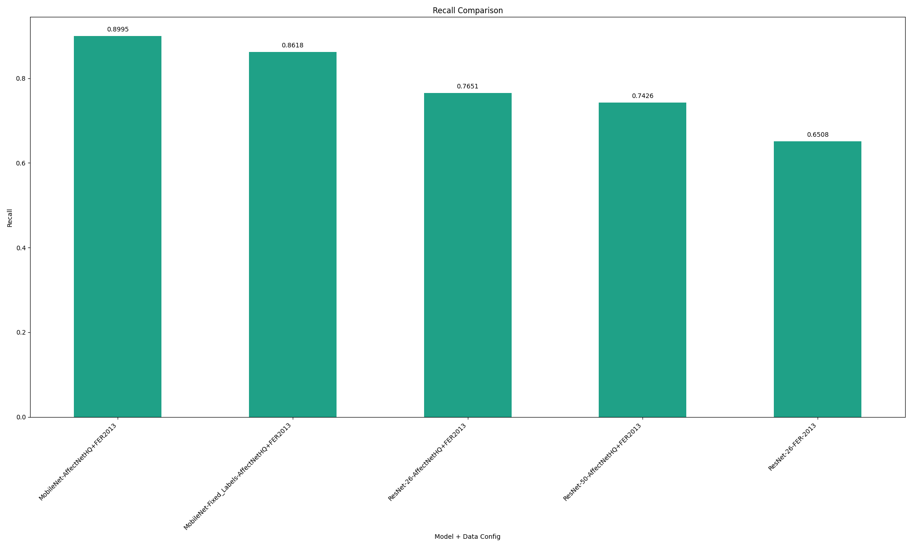

# ECE-556-RaspberryPi-Emotion-Recog
WPI ECE 556 Raspberry Pi Emotion Recognition Deep Learning Project

# How to run code:

Demo example was run on Raspberry Pi 5 with a IMX708 camera module. Cloning the repository with the correct hardware configuration (Camera module in cam1 location) will allow you to run the code. A window will open with the camera feed and model inference overlay, displaying the frame time and model inference time. Demo video can be accessed on youtube with the following link https://youtu.be/TvRDpmDnxk0. The code utilizes a rolling average with the most common predicted label over the previous few inferences to create a smoothed displayed label, this may cause a slightly noticeable delay in the displayed label and emotion demonstrated.

1. Install python requirements (torch, transformers, picamera2, opencv-python)
2. python3 original_example.py

# Architecture Diagram:

# Model Performance Analysis

Validation Loss:

Accuracy:

Precision:

Recall:

F1:

