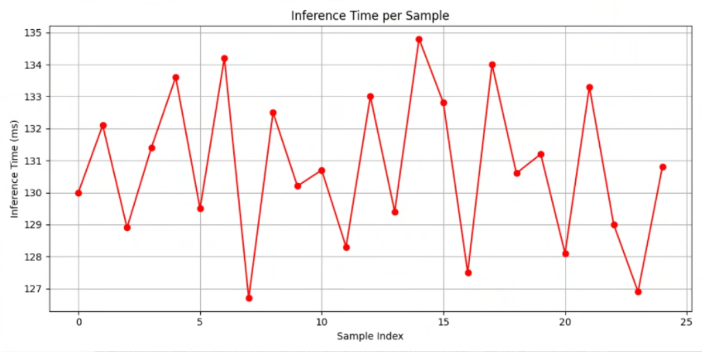
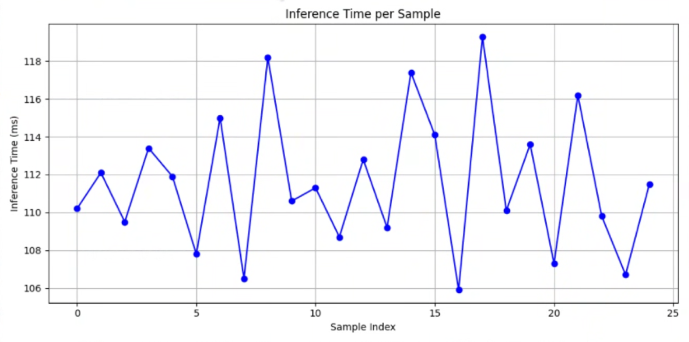

# ECE-556-RaspberryPi-Emotion-Recog
WPI ECE 556 Raspberry Pi Emotion Recognition Deep Learning Project

# How to run code:

Demo example was run on Raspberry Pi 5 with a IMX708 camera module. Cloning the repository with the correct hardware configuration (Camera module in cam1 location) will allow you to run the code. A window will open with the camera feed and model inference overlay, displaying the frame time and model inference time. Demo video can be accessed on youtube with the following link https://youtu.be/TvRDpmDnxk0. The code utilizes a rolling average with the most common predicted label over the previous few inferences to create a smoothed displayed label, this may cause a slightly noticeable delay in the displayed label and emotion demonstrated.

1. Install python requirements (torch, transformers, picamera2, opencv-python)
2. python3 original_example.py (Full Model)
3. python3 quantized_example.py (Quant + Prune Model)
4. python3 power_monitor.py (Calculates SOC Power over 10 second interval)

# Architecture Diagram:

MobileNet V2 Model Architecture
| Layer Type                  | Input Size    | Output Size   | Kernel Size | Stride | Expansion Factor |
|----------------------------|---------------|----------------|-------------|--------|------------------|
| Initial Conv               | 224x224x3     | 112x112x32     | 3x3         | 2      | -                |
| Inverted Residual Block    | 112x112x32    | 112x112x16     | 3x3         | 1      | 1                |
| Inverted Residual Block x2 | 112x112x16    | 56x56x24       | 3x3         | 2      | 6                |
| Inverted Residual Block x3 | 56x56x24      | 28x28x32       | 3x3         | 2      | 6                |
| Inverted Residual Block x4 | 28x28x32      | 14x14x64       | 3x3         | 2      | 6                |
| Inverted Residual Block x3 | 14x14x64      | 14x14x96       | 3x3         | 1      | 6                |
| Inverted Residual Block x3 | 14x14x96      | 7x7x160        | 3x3         | 2      | 6                |
| Inverted Residual Block x1 | 7x7x160       | 7x7x320        | 3x3         | 1      | 6                |
| Final Conv                 | 7x7x320       | 7x7x1280       | 1x1         | 1      | -                |
| Global Avg Pooling         | 7x7x1280      | 1x1x1280       | -           | -      | -                |
| Fully Connected            | 1x1x1280      | 1x1x1000       | -           | -      | -                |

Tragoudaras, Antonios & Stoikos, Pavlos & Fanaras, Konstantinos & Tziouvaras, Athanasios & Floros, George & Dimitriou, Georgios & Kolomvatsos, Kostas & Stamoulis, Georgios. (2022). Design Space Exploration of a Sparse MobileNetV2 Using High-Level Synthesis and Sparse Matrix Techniques on FPGAs. Sensors. 22. 4318. 10.3390/s22124318. 

# Model Performance Analysis

We evaluated different model architectures to find a base model with sufficient accuracy. The FER-2013 dataset is small and commonly has overfitting, so we added the affectnet dataset to it as well. The combination led to sufficient accuracy (>0.85) for the mobilenet architecture. ResNet-50 and ResNet-26 both struggled for accuracy and validation loss. The Precision and Accuracy plots closely resemble each other as the dataset was closely balanced.

Validation Loss:

Accuracy:

Precision:

Recall:

F1:

# On Device Measurements

For model compression we quantized model weights to 8-bits, in addition to a 25% channel prune on the convolution layers. This was able to reduce the model size from 13.5MB to 8.68MB. The accuracy tradeoff was a -4.19% loss. The 25% prune was chosen based on the quantized + pruned model accuracy. We were targeting a loss less than 5% and an increased aggression in channel pruning led to a sharp drop in accuracy greater than our threshold.

File Size Comparison
| Model           | File Size |
|-----------------|-----------|
| Full            | 13.5MB    |
| Quant + Prune   | 8.68MB    |

| Config                         | Memory Usage | CPU Usage | Power Consumption | Inference Time |
|-------------------------------|--------------|-----------|-------------------|----------------|
| Idle                          | N/A          | 2%        | 2.03 Watts        | N/A            |
| No Model (Just Display Window)| 330MB        | 5%        | 3.24 Watts        | N/A            |
| Quant + Pruned                | 430MB        | 32%       | 4.37 Watts        | 110ms          |
| Full Model                    | 470MB        | 37%       | 5.51 Watts        | 130ms          |

Power consumption was calculated using the power_monitor.py script. It reads the Raspberry Pi PMIC Voltage and Current. This reports all of the core voltages and currents in addition to IO such as the ADC. The power was computed with voltage and current then summed for each component. Sampling was done every 0.1 seconds over a 10 second span and the average power consumption was computed for this period. Additionally, plots below show power consumption over time, demonstrating power spikes during model inferencing.

Full Model Power Consumption:

Pruned + Quantized Model Power Consumption:

Full Model Inference Time:

Pruned + Quantized Model Inference Time:

Another metric not listed here is the frame time, or the time it takes for python to fetch the Raspberry Pi camera frame. We found that this time depended on the inference time. With a long inference time >150ms the next frame from the camera module is available immediately. When the inference time is reduced, the frame time will increase. The combination of inference time and frame time will give the operational frames per second, for the demo code this was approximately 8 FPS. We found the Raspberry Pi had a low frame rate to begin with, when the trained model was omitted. To compensate for this the frame size was set to 640x480, providing enough area for a face to be centered in the captured frame. Additionally, the plan has to initially use a Haar Cascade model to identify a face within a frame and crop the image for inferencing. We found in testing the Haar Cascade inferencing time was approximately 20ms. Given the smaller frame size it was assumed the face would be centered in the camera for the most part, with this we removed the Haar Cascade in order to improve the frame rate.
